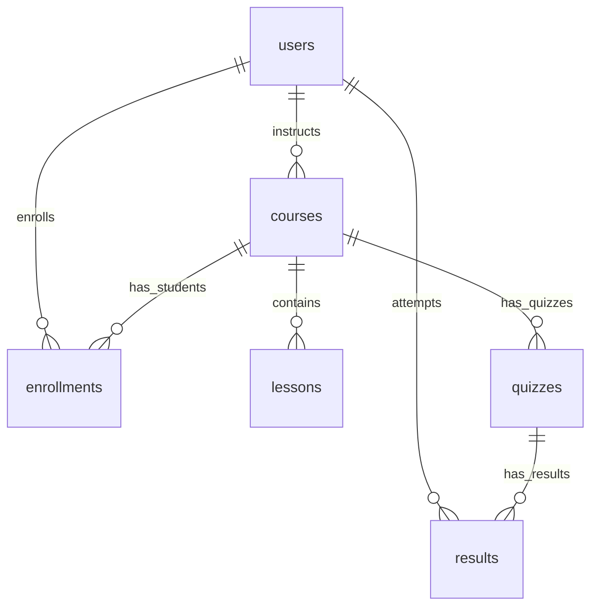

# CloudLearn LMS (Learning Management System)

CloudLearn LMS is a comprehensive, full-stack Learning Management System designed to manage courses, lessons, student enrollments, quizzes, and quiz results. The platform supports role-based access control with distinct actions and views for **Students**, **Instructors**, and **Admins**.

---

## 🏗️ System Architecture

The application is structured as a decoupled client-server architecture:

```
┌────────────────────────────────┐
│         React Client           │
│  (Vite, Tailwind CSS, Axios)   │
└───────────────┬────────────────┘
                │ HTTP / REST API
                ▼
┌────────────────────────────────┐
│      Express API Server        │
│    (Node.js, JWT, Multer)      │
└────────┬──────────────┬────────┘
         │              │
         ▼              ▼
┌────────────────┐┌──────────────┐
│  Supabase DB   ││    AWS S3    │
│  (PostgreSQL)  ││ (File Store) │
└────────────────┘└──────────────┘
```

### Frontend (Client)
* **Framework**: React 19 bootstrapped with Vite 8.
* **Styling**: Tailwind CSS v4 for utility-first styling.
* **Routing**: React Router DOM v7 for declarative client-side routing.
* **API Client**: Axios with automatic request interceptors to inject JWT authentication tokens from localStorage.
* **Entrypoint**: [frontend/src/main.jsx](file:///c:/Users/Dilshan%20Mindika/Downloads/CloudLearn-LMS/frontend/src/main.jsx)

### Backend (Server)
* **Runtime & Framework**: Node.js & Express.js.
* **Database Client**: `@supabase/supabase-js` to connect to PostgreSQL hosted on Supabase.
* **Authentication**: JWT (JSON Web Tokens) for stateless token-based authorization.
* **Storage**: AWS SDK v3 S3 client for object storage (profile pictures, course files, documents).
* **Upload Handler**: Multer and `multer-s3` to pipe multipart uploads directly to AWS.
* **Entrypoint**: [server/server.js](file:///c:/Users/Dilshan%20Mindika/Downloads/CloudLearn-LMS/server/server.js)

---

## 📁 Repository Structure

### Server Directory
See the [server/](file:///c:/Users/Dilshan%20Mindika/Downloads/CloudLearn-LMS/server) directory.
* `config/`: Configuration modules for S3, Supabase, and DB connectors.
* `middleware/`: Custom middlewares for JWT parsing and role verification.
* `routes/`: Express routers organized by resource.
* `server.js`: Server bootstrapper.

### Frontend Directory
See the [frontend/](file:///c:/Users/Dilshan%20Mindika/Downloads/CloudLearn-LMS/frontend) directory.
* `src/api/`: Base API instance (Axios configured with authorization headers).
* `src/components/`: Reusable layouts, navbars, and routing guards.
* `src/pages/`: Component views corresponding to routes (Login, Dashboard, Course views, Quiz management, etc.).

---

## 🗄️ Database Schema & Live Stats (Supabase PostgreSQL)

The backend connects directly to a Supabase-managed PostgreSQL instance containing **6 core tables**. Below is the entity relationship overview and current schema details based on a live database query:

### Entity Relationship Diagram


### Table Definitions & Record Counts

#### 1. `users` (3 records)
Holds accounts for all students, instructors, and administrators.
* **Columns**:
  * `id` (`uuid`, Primary Key, auto-generated)
  * `name` (`text`, required)
  * `email` (`text`, required, unique)
  * `password` (`text`, hashed string)
  * `role` (`text`, nullable: `student`, `instructor`, `admin`)
  * `created_at` (`timestamp`)

#### 2. `courses` (3 records)
Holds courses created by instructors or admins.
* **Columns**:
  * `id` (`uuid`, Primary Key, auto-generated)
  * `title` (`text`, required)
  * `description` (`text`, optional description)
  * `instructor` (`text`, instructor name or image path)
  * `image_url` (`text`, optional image attachment link)
  * `instructor_id` (`uuid`, Foreign Key -> `users.id`)
  * `created_at` (`timestamp with timezone`)

#### 3. `lessons` (1 record)
Holds lessons/chapters belonging to a course.
* **Columns**:
  * `id` (`uuid`, Primary Key, auto-generated)
  * `course_id` (`uuid`, Foreign Key -> `courses.id`, cascade delete)
  * `title` (`text`, required)
  * `video_url` (`text`, URL for educational videos)
  * `content` (`text`, markdown/text body)
  * `created_at` (`timestamp with timezone`)

#### 4. `enrollments` (3 records)
Associates students with the courses they are registered in.
* **Columns**:
  * `id` (`uuid`, Primary Key, auto-generated)
  * `user_id` (`uuid`, Foreign Key -> `users.id`)
  * `course_id` (`uuid`, Foreign Key -> `courses.id`)
  * `created_at` (`timestamp with timezone`)

#### 5. `quizzes` (3 records)
Holds single-question multiple-choice quizzes created by instructors.
* **Columns**:
  * `id` (`uuid`, Primary Key, auto-generated)
  * `course_id` (`uuid`, Foreign Key -> `courses.id`)
  * `question` (`text`, required)
  * `option_a` (`text`, choice A)
  * `option_b` (`text`, choice B)
  * `option_c` (`text`, choice C)
  * `option_d` (`text`, choice D)
  * `correct_answer` (`text`, identical matching option text)
  * `created_at` (`timestamp with timezone`)

#### 6. `results` (3 records)
Maintains historical records of students' performance on quizzes.
* **Columns**:
  * `id` (`uuid`, Primary Key, auto-generated)
  * `user_id` (`uuid`, Foreign Key -> `users.id`, nullable)
  * `quiz_id` (`uuid`, Foreign Key -> `quizzes.id`)
  * `score` (`integer`, count of correct answers)
  * `completed_date` (`timestamp`)
  * `created_at` (`timestamp with timezone`)

---

## 📡 Backend API Endpoints

All backend routes are prefix-configured in [server/server.js](file:///c:/Users/Dilshan%20Mindika/Downloads/CloudLearn-LMS/server/server.js):

| Resource / Prefix | Method | Endpoint | Authentication | Allowed Roles | Description |
| :--- | :--- | :--- | :--- | :--- | :--- |
| **/users** | POST | `/register` | Public | All | Register a new user account |
| | POST | `/login` | Public | All | Log in and return JWT token |
| | GET | `/` | Public | All | Fetch all registered user records |
| **/courses** | POST | `/` | JWT | `instructor`, `admin` | Create a new course |
| | GET | `/` | Public | All | Get list of all courses |
| | GET | `/:id` | Public | All | Fetch a single course by ID |
| | PUT | `/:id` | JWT | `instructor`, `admin` | Modify an existing course |
| | DELETE | `/:id` | JWT | `instructor`, `admin` | Remove a course |
| **/lessons** | POST | `/` | JWT | `instructor`, `admin` | Create a course lesson |
| | GET | `/` | Public | All | List all lessons globally |
| | GET | `/course/:course_id` | Public | All | Fetch lessons for a specific course |
| | PUT | `/:id` | JWT | `instructor`, `admin` | Update lesson details |
| | DELETE | `/:id` | JWT | `instructor`, `admin` | Delete a lesson |
| **/enrollments** | POST | `/` | JWT | All | Enroll logged-in student in a course |
| | GET | `/my` | JWT | All | Get enrolled courses for logged-in user |
| | GET | `/` | JWT | All | View all enrollments across system |
| **/quizzes** | POST | `/` | JWT | `instructor`, `admin` | Create a new quiz |
| | GET | `/` | Public | All | Retrieve all quizzes globally |
| | GET | `/course/:course_id` | Public | All | Get all quizzes for a specific course |
| | GET | `/:id` | Public | All | Get a quiz by its ID |
| | DELETE | `/:id` | JWT | `instructor`, `admin` | Delete a quiz and its linked results |
| | POST | `/submit` | JWT | All | Submit answers for scoring and logging |
| **/results** | POST | `/` | JWT | All | Manually save a quiz result |
| | GET | `/` | Public | All | Fetch all student results |
| | GET | `/user/:user_id` | Public | All | Fetch results for a specific student |
| **/upload** | POST | `/` | Public | All | Upload a single file to AWS S3 |

---

## 🖥️ Frontend Routing & Role-Based Navigation

Routes and permissions are configured inside [frontend/src/App.jsx](file:///c:/Users/Dilshan%20Mindika/Downloads/CloudLearn-LMS/frontend/src/App.jsx):

* **Public Routes**:
  * `/` : Login screen ([frontend/src/pages/Login.jsx](file:///c:/Users/Dilshan%20Mindika/Downloads/CloudLearn-LMS/frontend/src/pages/Login.jsx))
  * `/register` : Account creation screen ([frontend/src/pages/Register.jsx](file:///c:/Users/Dilshan%20Mindika/Downloads/CloudLearn-LMS/frontend/src/pages/Register.jsx))

* **Protected Layout Routes (Requires Login)**:
  * `/dashboard` : User dashboard page
  * `/courses` : View all available courses
  * `/course/:id` : Course detail view (chapters list, options)

* **Navigation Sidebar Role Permissions**:
  * **Student**:
    * `/my-courses` : List of enrolled courses
    * `/results` : Historical quiz scores
    * `/take-quiz/:course_id` : Participate in course exams
  * **Instructor**:
    * `/add-course` : Course builder form
    * `/lessons` : List of lessons
    * `/add-lesson` : Add a lesson to a course
    * `/add-quiz` : Construct a quiz
    * `/quizzes` : View list of quizzes
    * `/edit-course/:id` : Edit course metadata
  * **Admin**:
    * `/add-course` : Build a new course
    * `/add-quiz` : Construct a quiz

---

## 🔑 Demo Login Credentials

Below are the pre-configured database accounts that can be used to log in and test role-based workflows:

| Role | Email Address | Password | Description |
| :--- | :--- | :--- | :--- |
| **Instructor** | `instructor@gmail.com` | `123456` | Full access to add/edit courses, add/edit lessons, and add/edit quizzes. |
| **Student** | `student@gmail.com` | `123456` | Access to view all courses, enroll, take quizzes, and view exam results. |
| **Student** | `student2@gmail.com` | `123456` | Alternative student account for testing peer enrollments or separate progress. |

> [!NOTE]
> All passwords for these credentials are encrypted using Bcrypt inside the database.

---

## 🚀 Local Quickstart Setup

Follow these steps to configure and boot up the project on your machine.

### Prerequisites
* Node.js (version 16+)
* npm (bundled with Node)

### 1. Backend Setup
1. Open a terminal and navigate to the `server/` directory:
   ```bash
   cd server
   ```
2. Install dependencies:
   ```bash
   npm install
   ```
3. Create a `.env` file inside the `server/` directory and populate it with the required keys (use values from your Supabase and AWS consoles):
   ```env
   PORT=5000
   SUPABASE_URL=YOUR_SUPABASE_PROJECT_URL
   SUPABASE_KEY=YOUR_SUPABASE_ANON_OR_SERVICE_KEY
   JWT_SECRET=YOUR_RANDOM_SECURE_JWT_SECRET
   AWS_REGION=YOUR_AWS_S3_REGION
   AWS_ACCESS_KEY_ID=YOUR_AWS_ACCESS_KEY
   AWS_SECRET_ACCESS_KEY=YOUR_AWS_SECRET_ACCESS_KEY
   AWS_BUCKET_NAME=YOUR_AWS_S3_BUCKET_NAME
   ```
4. Start the server (runs on `http://localhost:5000`):
   * Development mode (with hot-reloading):
     ```bash
     npm run dev
     ```
   * Production Mode:
     ```bash
     npm start
     ```

### 2. Frontend Setup
1. Open a terminal and navigate to the `frontend/` directory:
   ```bash
   cd frontend
   ```
2. Install dependencies:
   ```bash
   npm install
   ```
3. Boot up the Vite development server (runs on `http://localhost:5173` or `http://localhost:5174`):
   ```bash
   npm run dev
   ```
4. Build the application for production:
   ```bash
   npm run build
   ```